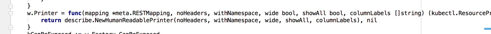

# oc 解读及重写
            
| NO | 功能 | 命令 | 提交纪录 | 时间 | 
| --- | --- | --- | --- | --- |
| 1 | oc get 扩展 | oc get servicebroker | 12ab826 | 2016/1/19 at 下午6:01  |

+ 目的
 
        实现 oc get servicebroker
        

+ 前置学习

---------------------------------------
    
   oc 命令入口
   
   
---------------------------------------

   oc 创建Cli命令  
   
   
---------------------------------------
   
   一级命令:    oc
   二级命令:    [get, create, types, login, project ...]
   

---------------------------------------
   
   oc get 使用k8s的代码实现
   相当于kubetcl get,但在基础上扩充了openshift自己的命令
   这是openshift的代码,直接引入了k8s的代码
   

---------------------------------------
    
   自定义命令 
   采用github.com/spf13/cobra架构实现
   核心业务在 Run 中
   
   
---------------------------------------
   看看RunGet做了什么
   

---------------------------------------

      K8s 客户端的调用参数
      // Builder provides convenience functions for taking arguments and parameters
      // from the command line and converting them to a list of resources to iterate
      // over using the Visitor interface.
      type Builder struct {
      	mapper *Mapper
      
      	errs []error
      
      	paths  []Visitor
      	stream bool
      	dir    bool
      
      	selector  labels.Selector
      	selectAll bool
      
      	resources []string
      
      	namespace string
      	names     []string
      
      	resourceTuples []resourceTuple
      
      	defaultNamespace bool
      	requireNamespace bool
      
      	flatten bool
      	latest  bool
      
      	requireObject bool
      
      	singleResourceType bool
      	continueOnError    bool
      
      	schema validation.Schema 
      }
   	
   

---------------------------------------
    
   Do()是客户端调用函数
   Visit()是打印的回调函数用来向指定输出的Io输出
   printer是输出格式的定义那么printer是从哪里来呢
   

---------------------------------------
    
   printer是K8s Factory 自有的printer
   当openshift包容了K8s的Factory时同时获取的K8s的一切功能
   但是这是功能没有openshift的业务,openshift只能通过重写覆盖来吧自己的东西和K8s的东西加在一起
   

---------------------------------------
   
   重写printer,可以打印openshift自己的命令
   

---------------------------------------
   
   HumanReadablePrinter 是对所有资源打印输出的格式控制结构体
   他会包含openshift和K8s所有resourse的输出定义
   
  
---------------------------------------
   
   而我们要做的是在openshift中添加servicebroker bankingservice
   这里是K8s自己的输出定义
   

+ 修改文件`
   
   看修改文件的路径完全属于openshift
   

+ 修改内容
   
   控制显示首行的名称
   
   
   
   
   打印资源属性
     
    