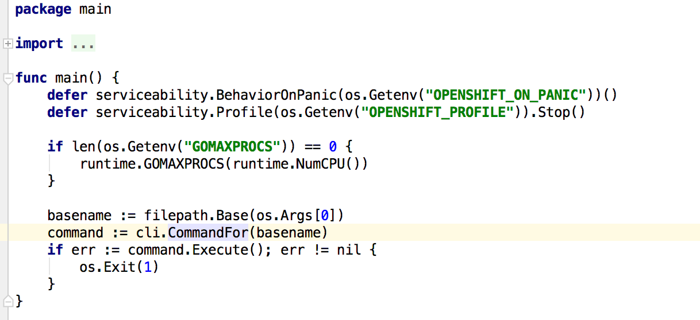
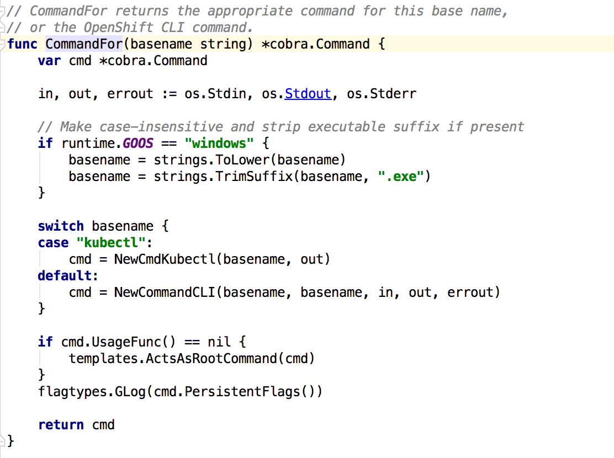

# oc 解读及重写
            
| NO | 功能 | 命令 | 提交纪录 | 时间 | 
| --- | --- | --- | --- | --- |
| 1 | oc get 扩展 | oc  | 12ab826 | 2016/1/19 at 下午6:01  |

+ 目的
 
        实现 oc get servicebroker
        

+ 前置学习

---------------------------------------
    
   oc 命令入口
   
   
---------------------------------------

   oc 创建Cli命令  
   
   
---------------------------------------
   
   一级命令:    oc
   二级命令:    [get, create, types, login, project ...]
   

---------------------------------------

+ 修改文件`
   
   看修改文件的路径完全属于openshift
   

+ 修改内容
   
   控制显示首行的名称
   
   
   
   
   打印资源属性
     
    