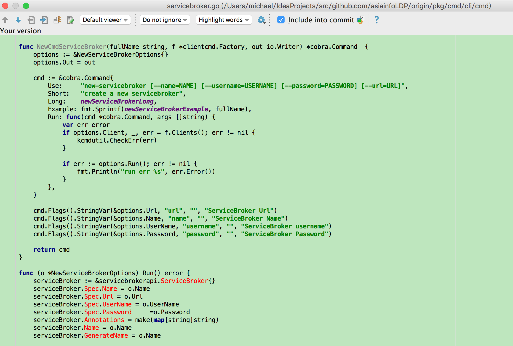

# oc 解读及重写
            
| NO | 功能 | 命令 | 提交纪录 | 时间 | 
| --- | --- | --- | --- | --- |

+ 目的
 
        实现 oc new-servicebroker mysql --username=michael --password=12345678 --url=http://192.168.1.1

+ 前置学习

---------------------------------------
    
   oc 命令入口
   
   
---------------------------------------

   oc 创建Cli命令  
   
   
---------------------------------------
   
   一级命令:    oc
   二级命令:    [get, create, types, login, project ...]
   注册new-servicebroker 二级命令
   

---------------------------------------
   
  定义servicebroker客户端接口
   
   

---------------------------------------
  
   将servicebroker客户端接口注册至客户端能力中
   

---------------------------------------
    
   

---------------------------------------
    
   

---------------------------------------
   
   命令行参数解析
   将解析的结构调用之前注册的客户端接口
   
   

